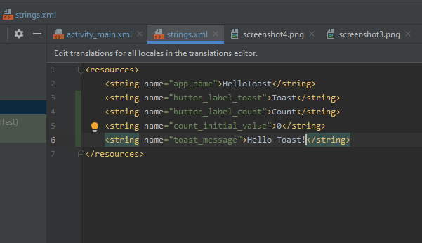
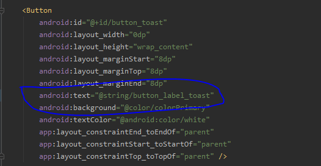
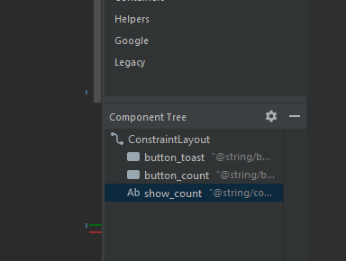

# First Interactive UI (PartA)
## Hello Toast App
### Task 5
#### Some useful strings are added to the string.xml

 

#### Using values of string resource file into the layout xml file.
 

#### By extracting the hardcoded string to the strings.xml, all the warning messages has been removed.
 